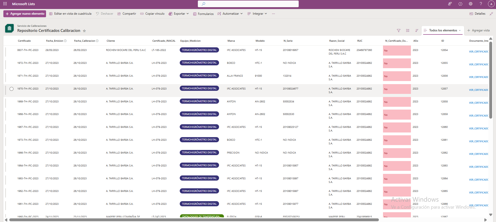
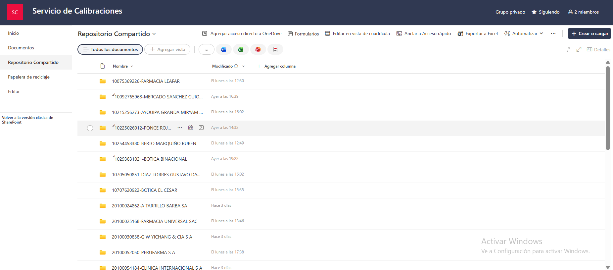
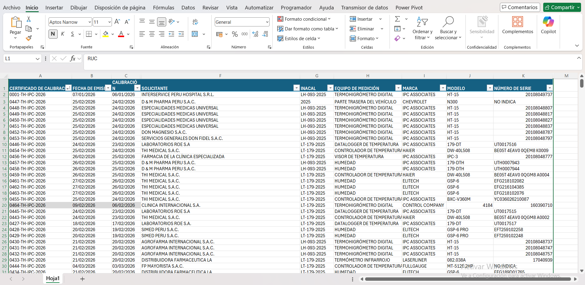
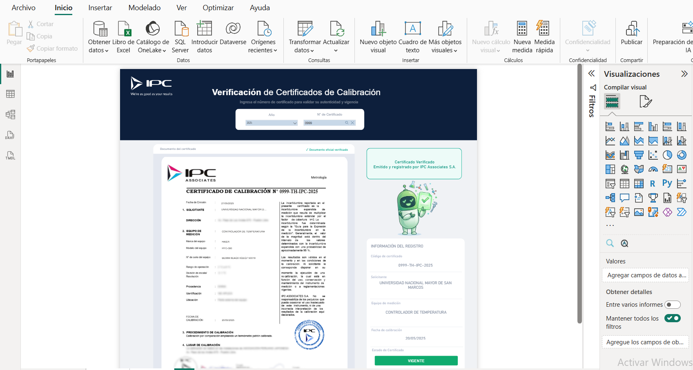
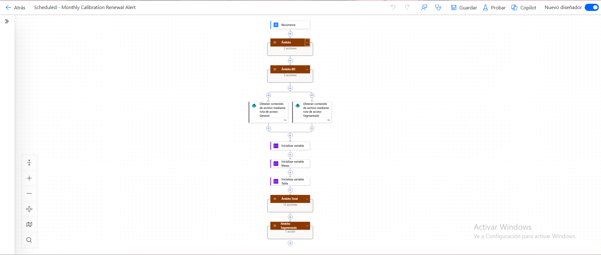

# IPC Associates — Plataforma de Gestión de Certificados de Calibración

## Contexto del problema

IPC Associates es una empresa especializada en servicio técnico y calibración de equipos de medición. Contaba con más de 5,000 certificados históricos en PDF sin estructura digital, lo que hacía imposible responder preguntas básicas como:

- ¿Qué equipos de un cliente tienen calibración próxima a vencer?
- ¿Existe el certificado N° X emitido en el año Y?
- ¿Qué comercial es responsable de cada cliente?

El ingreso manual de datos tomaba semanas y generaba errores humanos constantes.

---

## Solución implementada

Diseñé e implementé un ecosistema completo de gestión documental que automatiza desde la extracción de datos hasta la validación pública para clientes externos.

---

## Arquitectura del sistema

```
PDFs históricos
      ↓
[RPA - Power Automate Desktop]
Extracción masiva con Regex
      ↓
[Excel maestro consolidado]
      ↓
[Flujo Power Automate Online]
Carga, organización y renombramiento
      ↓
[SharePoint — Dos repositorios]
├── Repositorio interno (área calibraciones)
└── Repositorio comercial (segmentado por cliente)
      ↓
[Power BI — Validación pública]
Embebido en web de la empresa
Clientes verifican autenticidad de sus certificados
      ↓
[Power Apps — Seguimiento comercial]
Indicadores de desempeño por comercial
```

---

## Módulos del sistema

### 1. RPA — Extracción masiva de PDFs

Bot desarrollado en Power Automate Desktop que procesa cada certificado PDF de forma automática.

**Campos extraídos por certificado:**
- Número de certificado
- Fecha de emisión
- Fecha de calibración
- Empresa cliente
- Tipo de equipo, marca y modelo
- Número de serie
- Número de acreditación INACAL

**Técnicas utilizadas:**
- Expresiones regulares (Regex) para extracción de fechas
- CropText con flags específicos por sección del documento
- Extracción de tablas de página 2 para datos INACAL
- Renombramiento automático: `NUMERO_CERTIFICADO_MARCA.pdf`

**Resultado:** Procesamiento de 5,000+ documentos con reducción del 95% en tiempo de digitación y eliminación de errores humanos.

---

### 2. Repositorio documental en SharePoint

Dos estructuras diferenciadas según el tipo de usuario:

**Repositorio interno** (área de calibraciones)

```
Año/
└── Mes/
    └── Certificado_Cliente.pdf
```

**Repositorio comercial** (área comercial)

```
Cliente/
└── Año/
    └── Mes/
        └── Certificado.pdf
```

---

### 3. Validación pública para clientes externos

Dashboard Power BI embebido en la página web pública de la empresa.

**Flujo de validación:**
1. Cliente ingresa año de emisión y número de certificado
2. El sistema verifica existencia en la base de datos
3. Si existe, retorna la copia PDF del certificado
4. Si no existe, muestra mensaje de certificado no encontrado

El formulario solo se habilita si el certificado existe, evitando consultas vacías y protegiendo la integridad del sistema.

---

### 4. Sistema de recordatorios automáticos

Flujo Power Automate que conecta tres fuentes de datos:
- Repositorio de certificados (SharePoint)
- Tabla de asignación cliente-comercial (por RUC)
- Maestro de personal del área comercial

**Envíos automáticos:**
- **Correo general:** todos los dispositivos próximos a vencer del período, con Excel adjunto consolidado
- **Correo personalizado por comercial:** solo sus clientes, con PDF y Excel filtrados

**Trazabilidad documental:**

```
Año/
└── Mes/
    └── NombreComercial/
        ├── reporte_general.xlsx
        ├── reporte_general.pdf
        └── [Comercial]_dispositivos.pdf
```

---

### 5. Power Apps — Seguimiento comercial

Aplicación para que el área comercial registre:
- Si los dispositivos asignados fueron ofrecidos al cliente
- Resultado de la gestión comercial
- Indicadores de desempeño vs meta asignada en el flujo

---

## Stack tecnológico

| Herramienta | Uso |
|-------------|-----|
| Power Automate Desktop | RPA — extracción masiva PDF |
| Power Automate Online | Orquestación de flujos cloud |
| SharePoint | Repositorio documental estructurado |
| Power BI | Dashboard de validación pública |
| Power Apps Canvas | Seguimiento comercial |
| Excel | Consolidación de datos extraídos |
| Regex | Extracción de patrones en texto no estructurado |

---

## Capturas del sistema

### Repositorio documental en SharePoint


### Lista consolidada de certificados


### Excel resultado del RPA


### Dashboard Power BI — validación pública


### Flujo de recordatorios automáticos


---

## Resultados

| Métrica | Antes | Después |
|---------|-------|---------|
| Tiempo de digitación por certificado | 3-5 min manual | Automático |
| Documentos procesados | 0 digitalizados | 5,000+ |
| Errores de digitación | Frecuentes | Eliminados |
| Verificación para clientes | No disponible | Web pública |
| Recordatorios comerciales | Manual / inexistente | Automático |

---

## Autor

**Cristopher Ramos Osorio**
Power Platform Developer | Lima, Perú
[LinkedIn](https://linkedin.com/in/cristopher-ramos-powerplatform) | [GitHub](https://github.com/cristopher-ramos)
